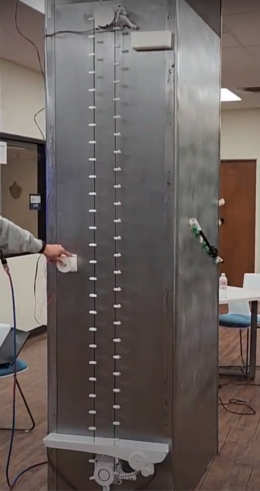
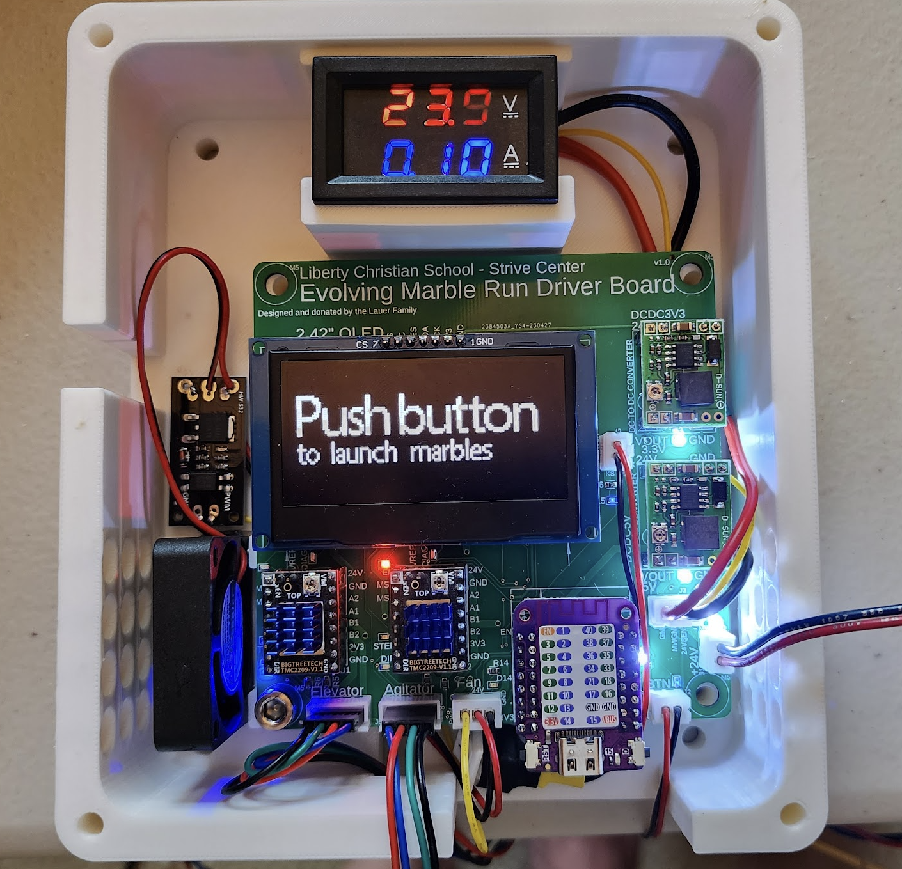
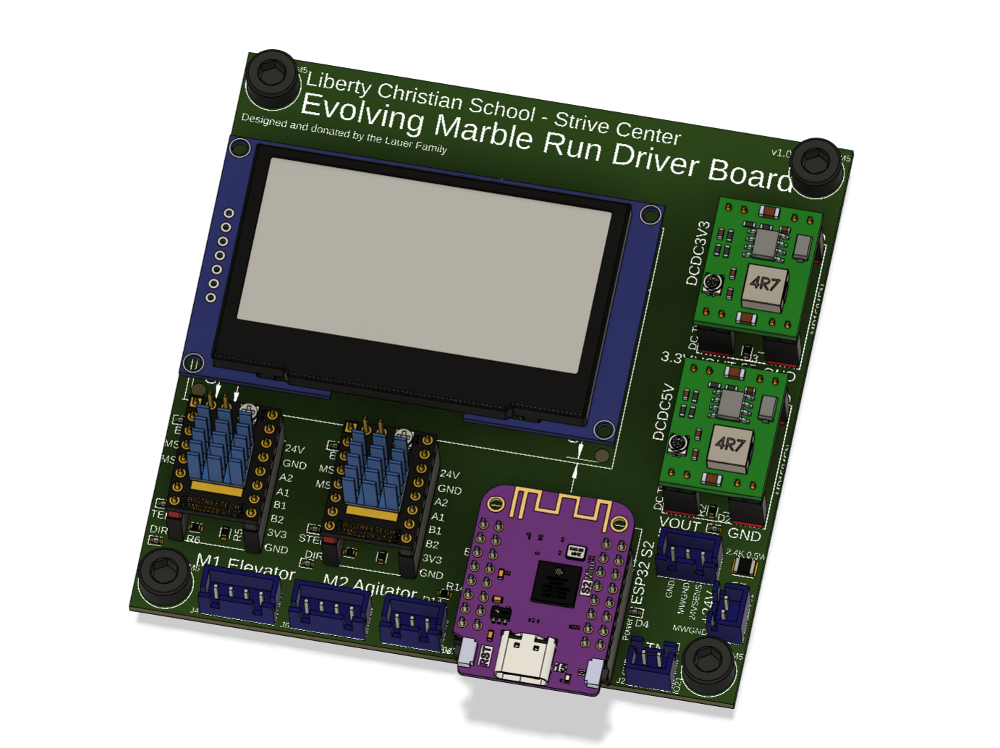
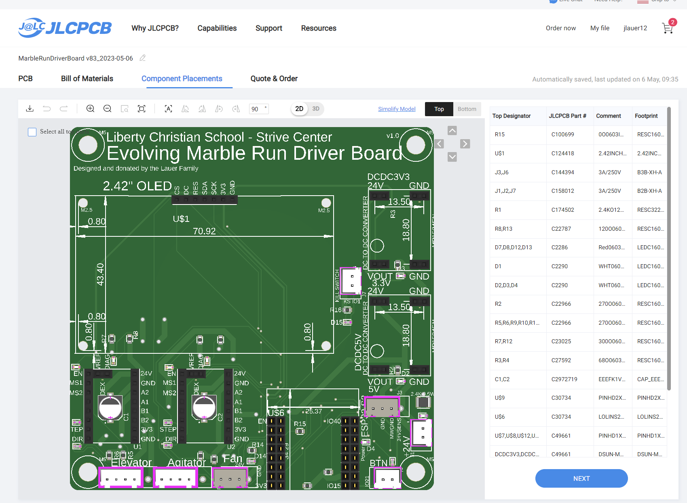
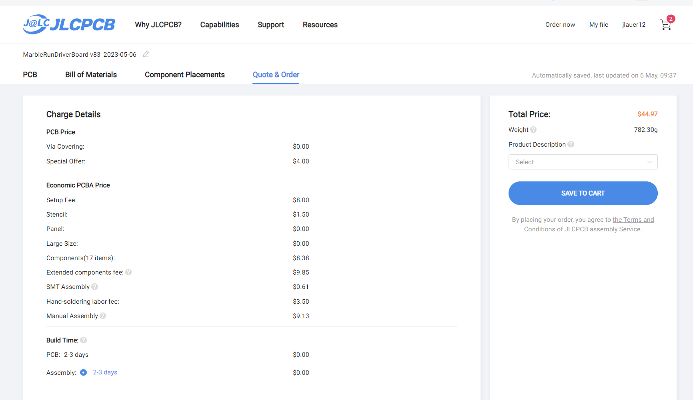

# Liberty Christian School - Strive Center - Evolving Marble Run

Author: John Lauer

<i>This project was donated to the Liberty Christian School to inspire the kids to embrace today's modern tools to innovate for our future.</i>

This repo contains the following items:
- <b>Fusion 360 Marble Run Design</b> - The 3D design of the Marble Run that hangs on the wall
- <b>Fusion 360 PCB Board Design</b> - The 3D electronics design of the PCB that drives the Marble Run
- <b>3D Printer 3MF Files</b> - The 3MF 3D printable files for all of the parts

# Fusion 360 Marble Run Design

<table>
<tr><td>
The Marble Run hangs on a wall that is at least 8' high, although you could adjust the height in 80mm increments 
by just reducing how many "scoops" are on the GT2 timing belt. 

The main parts of this design are:
- The top NEMA 23 stepper motor with GT2 timing belt gear and "popper outer" component that pops the marbles off the scoops and onto the track
- The bottom idler pulley, marble reservoir, agitator (to ensure marbles fill the loading pipe), and the loading pipe to the scoops.
- Track components including straight rails and 90 degree corner angle rails.

The idea for the Marble Run is to inspire the kids to print their own section of track, using any design they dream up, to contribute to getting the marble to roll all the way from the top of the elevator back to the reservoir at the bottom. This will requires hundreds of sections of track to loop around a column in the STEM lab. Kids will learn how to use CAD to design their track and how to 3D print.

You can view the Fusion 360 design in the Autodesk gallery online. https://a360.co/3HKXjhC

To print all of the parts of the Marble Run, you can view the Fusion 360 design and export each body as a 3MF. A directory of 3MF's is also made available in this repo.
</td>
<td width="200">

</td>
</tr>
</table>

# Fusion 360 PCB Board Design

This is the driver board for the Marble Run. It has the following main modules:
- ESP32-S2 (Lolin S2 Mini)
- Stepper Motor TMC2209 Driver for Elevator
- Stepper Motor TMC2209 Driver for Agitator
- 2.42" OLED Display
- 24V to 5V DC to DC Converter
- 24V to 3.3V DC to DC Converter (Should have instead used AMS1117-3.3v off 5v bus)
- 24V Fan MOSFET Driver
- 24V Fan

You can view the board online in the Autodesk Gallery.
https://a360.co/3p5fhET

This is a screenshot of what the PCB looks like inside Fusion 360.

This is a preview of the board when ordering from JLCPCB including its placed components from their parts library.

Here is a cost summary of the board.

The code for running on an ESP32-S2 to control the Liberty Christian School Evolving Marble Run is available
in the "circuitpython 8.1.0 code" directory.

This is the board mocked up on a breadboard first before creating the final PCB.

# Schematic

# Details of the Marble Run Components

This is a full view of the 8 foot tall Marble Run elevator that carries marbles from the bottom reservoir to the top of the run. This was mocked up prior to installing in the lab.

This is a 3D rendering of the Marble Run. It was designed in CAD first to get all of the parts correct.

This is the bottom reservoir. It has an agitator to ensure marbles are continuallyl flowing into the exit pipe, thus
ensuring the elevator is constantly picking up a new marble.

This is the 3D rendering of the bottom reservoir.

This is the motor at top which rotates the GT2 timing belt. It is a NEMA 23 stepper motor.

This is the 3D rendering of the motor.

