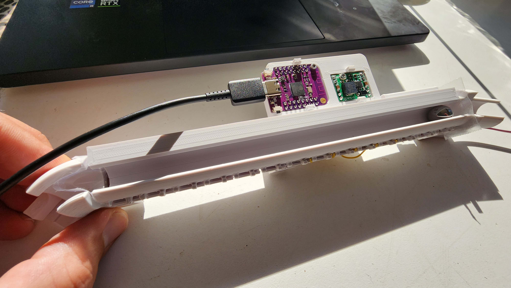
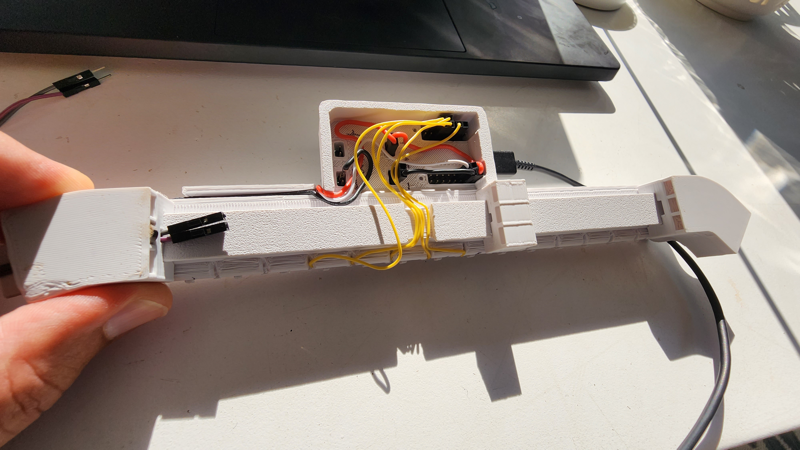
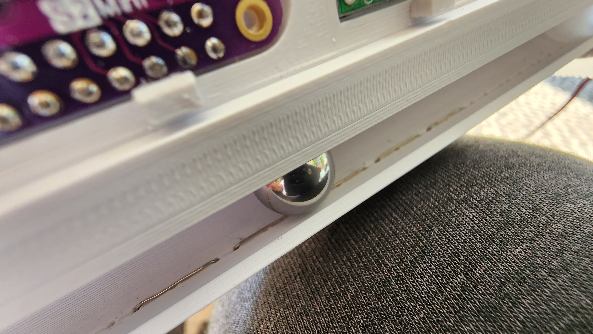
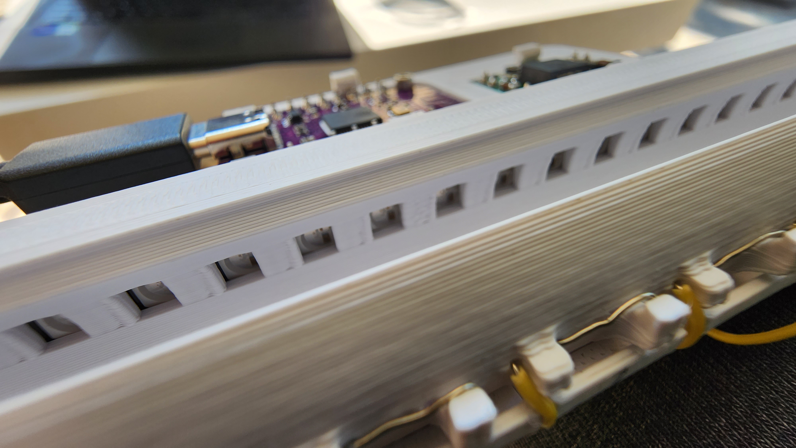
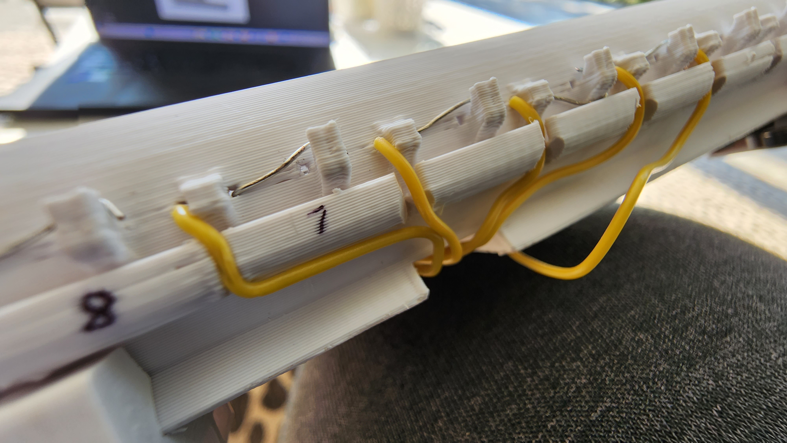
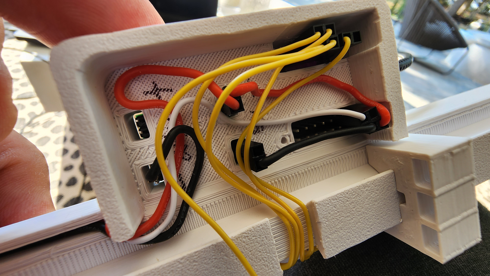
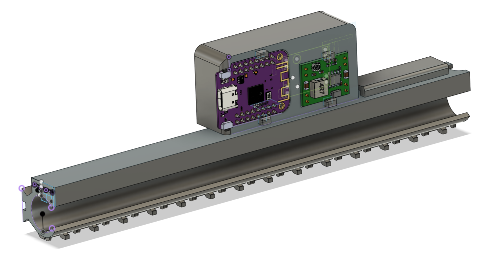
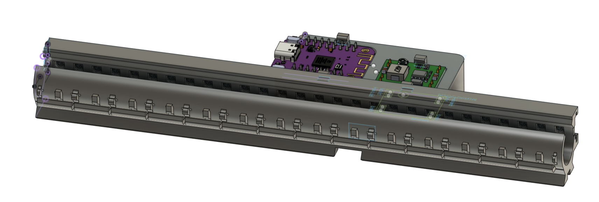
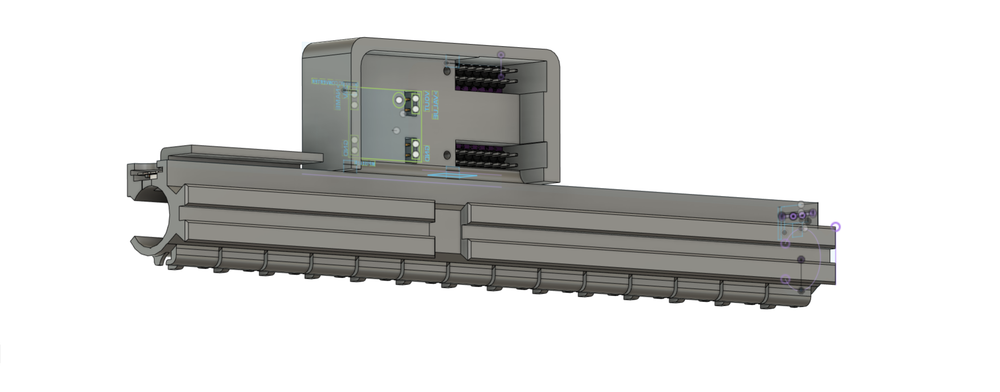

# LED Light Up Tube for Liberty Christian School Marble Run

This folder contains the CAD and circuitpython source code to build the
Light Up LED Tube running an ESP32-S2 mini to control 14 touch sensors.

The sensors trigger 28 WS2812 LED's with 2 LED's paired to each touch sensor.
As the stainless steel marble rolls across a wire embedded in the tube, it 
triggers the touch sensor which illuminates 2 LED's at full blue brightness
the moment it's touched.

Then a loop slowly fades the blue color as time progresses. Since the marble
triggers each touch sensor a fraction of a second after the prior one, you
get a rolling effect across the LED's as they match the rolling speed of
the marble.

There is also a 24v to 5v DC to DC converter used in the circuit so that
you can power the LED tube from the 24v wire that runs along the marble run
track. New wall magnet brackets were designed to accomodate the 24v wire.

Front photo of LED Tube

Back photo of LED Tube

The 14 touch wires run along the bottom of the tube and the stainless steel ball
bearing rolls over them to trigger a touch capacitance change on the ESP32 microcontroller.

28 WS2812 RGB LEDs run along the top of the tube. They are controlled by one GPIO port on the
ESP32 which sends the color changing commands to the LED with a high refresh rate to create
the animations of the LEDs as the marble rolls along the track.

Wires are run along the bottom of the tube and into the ESP32 into their appropriate GPIO ports.

The wiring on the back of the ESP32

Front angle 1 CAD rendering of LED Tube

Front angle 2 CAD rendering of LED Tube

Back angle CAD rendering of LED Tube

